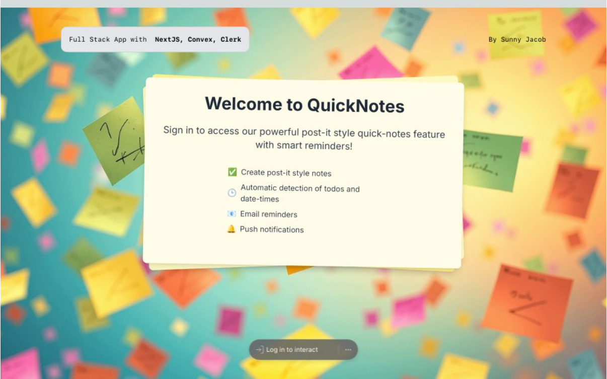

# Full Stack NextJS Notes App 

`NextJS` `React` `Typescript` `Tailwind` `Convex` `Clerk` `Shadcn`

Built with `create-next-app`

To run the app in dev mode:

> cd next-app
> 
> npm run dev

To deploy Convex functions,
in another terminal run:
> npx convex dev

To deploy on vercel:

> vercel
> 
> vercel --prod

## Build Notes:

### Create NextJS App

> npx create-next-app next-app

### Setup Convex

>npm install convex

>npx convex dev

### Setup Clerk with Convex

create convex/auth.config.ts

deploy by running: npx convex dev

> npm install @clerk/nextjs

create file: [ConvexClerkProvider.tsx](next-app%2Fcomponents%2Fproviders%2FConvexClerkProvider.tsx)

add NavBar with SignIn buttons etc.,

---
inspiration:
https://www.youtube.com/watch?v=4ojKx770_0Q
